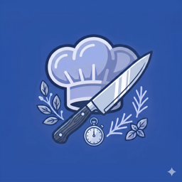
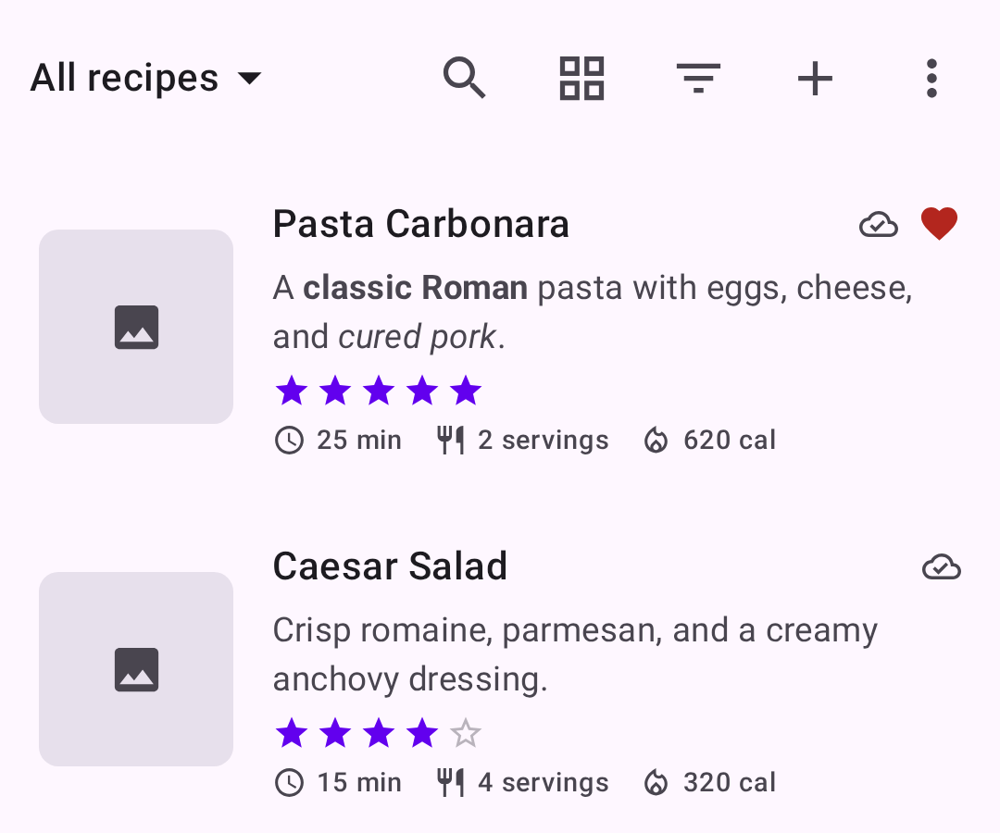
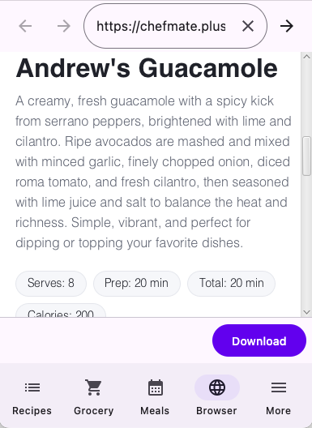
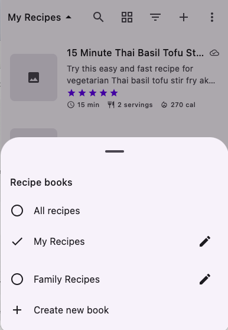
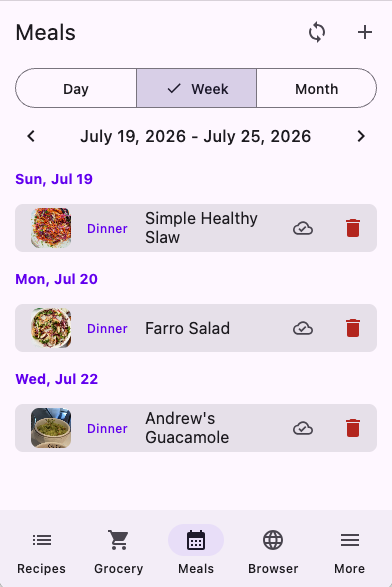
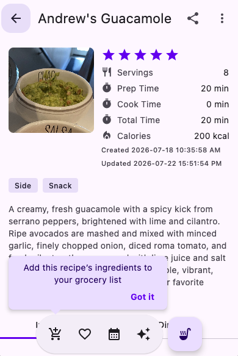
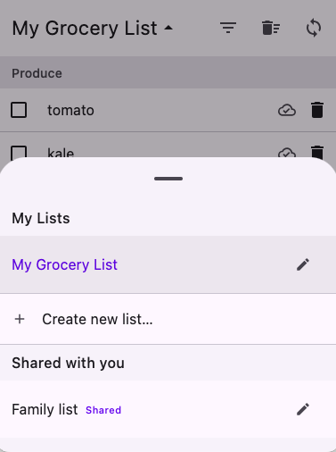
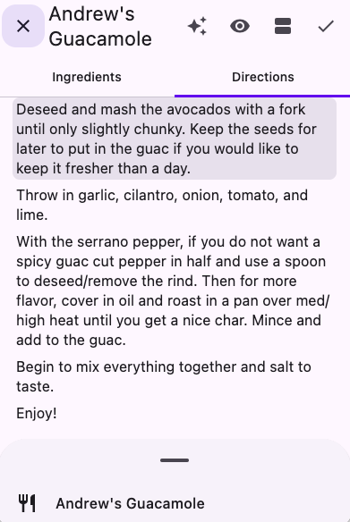
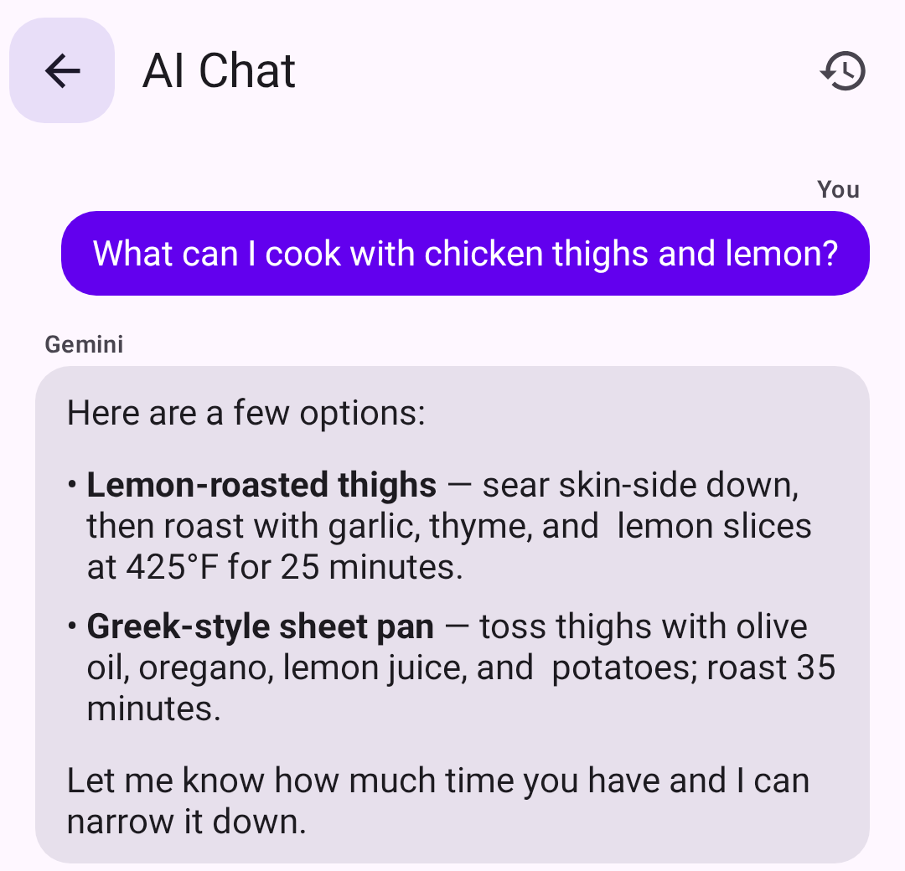

# Chef Mate

{ width="96" }

### Your personal cooking companion

Save recipes from anywhere, plan your week, and shop smarter — all in one app.

[Download Chef Mate](download.md){ .md-button .md-button--primary }

## Everything you need to cook

-   

    ---

    __All your recipes, organized__

    Browse your saved recipes with photos, star ratings, and cook time at a glance — mark favorites so you never lose track of what to make next.

-   

    ---

    __Save recipes from anywhere__

    Found a recipe on the web? Share it into Chef Mate from Safari or Chrome, or search from the built-in browser — the photo, ingredients, and steps come straight into your collection, no copying and pasting.

-   

    ---

    __Organize with recipe books__

    Group recipes into as many books as you like — weeknight dinners, holiday baking, family favorites — and share a book with friends and family so everyone cooks from the same collection.

-   

    ---

    __Plan your week__

    Drop any recipe onto a day on your calendar to map out breakfast, lunch, and dinner, so there's never a question of what's for dinner.

-   

    ---

    __Smart grocery lists__

    Send a recipe's ingredients straight to a grocery list with one tap. Chef Mate combines duplicates so you never buy the same thing twice.

-   

    ---

    __Shop together__

    Keep more than one list — one for the week, one for a party — and share a list with family or roommates so everyone's changes stay in sync while shopping.

-   

    ---

    __Cook hands-free__

    Tap Start Cooking for a distraction-free, step-by-step view. Text stays large and your screen won't dim, so you can keep both hands on the food.

-   

    ---

    __Ask your AI cooking assistant__

    Stuck on what to make or need a substitution? Ask Chef Mate's built-in AI assistant and turn its answer into a new recipe with one tap.

## Available everywhere

Chef Mate runs on iOS, Android, macOS, Linux, and Windows, so your recipes, meal plan, and grocery lists stay in sync no matter what you're cooking on.

[See download options](download.md){ .md-button }

## Contact

Have questions or feedback? Reach out to us at **support@plusmobileapps.com**.
